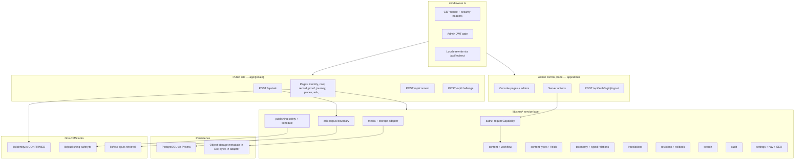

# CMS-01 Architecture — EJC Content Operating System

Project: `eroish.clevones.com`. Baseline: PR #1 branch `cursor/ejc-identity-platform-90e1` (head `8d4a1e9` or later). This package **extends** the existing Next.js identity platform. It does not replace the frontend, destroy the admin, introduce a separate CMS app, merge PR #1, or deploy.

<!-- cms-canonical
roles: SUPER_ADMIN, ADMIN, EDITOR, AUTHOR, REVIEWER, MEDIA_MANAGER
capabilities: content.create, content.edit, content.review, content.publish, content.delete, content.verify, media.upload, media.delete, users.manage, roles.manage, settings.manage, audit.read
workflow: DRAFT, IN_REVIEW, APPROVED, SCHEDULED, PUBLISHED, UNPUBLISHED, ARCHIVED
truth: VERIFIED, UNVERIFIED, TO_CONFIRM, PRIVATE
-->

**Hard content rule.** Never invent EJC biography. The only confirmed place is Kinshasa (born 1 September 1994). No mottos or slogans are attributed to EJC. `lib/identity.ts` (`CONFIRMED`) remains the compile-time identity lock until a later phase proves CMS rows match it. Any example rows below are **illustrative and non-factual**.

**Two independent axes (mandatory).** Workflow states (`DRAFT`, `IN_REVIEW`, `APPROVED`, `SCHEDULED`, `PUBLISHED`, `UNPUBLISHED`, `ARCHIVED`) never imply truth. Truth statuses (`VERIFIED`, `UNVERIFIED`, `TO_CONFIRM`, `PRIVATE`) never imply publication. Publishing must never silently verify anything.

**Visibility vs label (D1).** A row is publicly reachable only when `workflowState = PUBLISHED` **and** `visibility = PUBLIC` **and** `deletedAt` is null **and** `truthStatus != PRIVATE`. `truthStatus` decides the **label**, never visibility. `UNVERIFIED` / `TO_CONFIRM` public rows must render “à confirmer / to confirm” (or “unverified”) and must never be phrased as fact. `PRIVATE` is unreachable by public queries and by Ask EJC. `IN_REVIEW` is **admin-only** (no public-IN_REVIEW exception). Today’s NOW/Challenge `REVIEW` placeholders migrate to `PUBLISHED` + `TO_CONFIRM` (see `docs/CMS-MIGRATION.md`).

---

## 1. Existing-system assessment

The running app is already a structured identity system with a Prisma schema, a seed, public loaders, an admin command center, publishing safety, audit/revisions, and sourced Ask EJC. It is **not** yet a Content Operating System: most writes are seed-time, most admin screens are read + publish, Journey and UI chrome are hard-coded, there is no RBAC, no media storage, no custom types, and no translation lifecycle.

### Runtime and ops (as built)

| Item | Evidence |
|---|---|
| Next.js 15 App Router, React 19, TypeScript strict | `package.json`, `next.config.ts` |
| Tailwind v4 editorial tokens | `tailwind.config.ts`, `app/globals.css` |
| Prisma 6 + SQLite locally / CI | `prisma/schema.prisma` datasource `provider = "sqlite"`; `.env.example` `DATABASE_URL="file:./dev.db"`; `.github/workflows/ci.yml` |
| PostgreSQL intended for production | `docs/DEPLOYMENT.md`; stub `prisma/schema.postgres.prisma` (datasource only — **no models copied**) |
| No `prisma/migrations/` directory | repo uses `prisma db push` (`package.json` `db:push` / `db:reset`) |
| PM2 on port 3001, Nginx vhost | `ops/pm2/ecosystem.config.cjs`, `ops/nginx/eroish.clevones.com.conf` |
| Root + locale layouts `force-dynamic` (CSP nonce) | `app/layout.tsx`, `app/[locale]/layout.tsx`, `docs/ARCHITECTURE.md` |
| Vitest + Playwright | `tests/unit/*`, `tests/e2e/*`, CI quality job |

### Auth and admin (as built)

- Single `AdminUser` + `Session` (`prisma/schema.prisma`). **No role column.**
- HMAC JWT via `jose` (`lib/auth-verify.ts` `signAdminToken` / `verifyAdminToken`); `jti` is the `Session.id`.
- Cookie `ejc_admin_session`: HttpOnly, SameSite=lax, 8h; `Secure` only in production HTTPS (`lib/auth-cookie.ts` `shouldSetSecureCookie`).
- Middleware JWT check on `/admin` except `/admin/login` (`middleware.ts`). Node `requireAdmin()` (`lib/admin/session.ts`) re-checks `Session` row + user.
- Login `app/api/auth/login/route.ts` (argon2, session insert, audit `LOGIN`). Logout `app/api/auth/logout/route.ts` deletes the session row.
- Open-redirect hardening: `lib/safe-relative-path.ts`, `lib/admin-login-path.ts` `safeAdminNext` (console paths only), `app/api/redirect/route.ts`.
- Admin nav: `lib/admin/resources.ts` `ADMIN_NAV` (dashboard, identity, now, record, proofs, places, ventures, ledger, thinking, signals, challenges, ask, connect, media, learning, security, analytics).
- Writes today: `app/admin/actions.ts` `attemptPublish`, `updateIdentityTagline`, `decideLearningProposal`, `moderateChallenge`. Most console pages are list + `PublishButton`.

### Content sources today (three layers)

1. **Compile-time confirmed facts** — `lib/identity.ts` `CONFIRMED` and `personJsonLd()`. Homepage confirmed list (`app/[locale]/page.tsx`) reads this module, not only the DB. Schema.org Person JSON-LD is emitted from the root layout.
2. **Hard-coded FR/EN chrome and some facts** — `lib/i18n.ts` dictionaries (`en` / `fr`) plus `exploreItems`. Journey chapters are hard-coded in `components/journey/journey-chapters.tsx` `journeyChapters()` (verified origin/places/responsibility; builder = needs confirmation; record = no badge). Principles personal section is empty (`app/[locale]/principles/page.tsx`).
3. **Seeded relational content** — `prisma/seed.ts` upserts the bootstrap admin, writes EN+FR `IdentityProfile`, Kinshasa `Place` + unconfirmed slot, CLEVONE SARL `Venture` (`exposureOnly: true`), birth `RecordEvent`, four `ProofItem`s, eight `NowKind`s × two locales as `REVIEW` / `NEEDS_CONFIRMATION` / `EXAMPLE`, example thinking/thesis/ledger/media, three approved `AskSource`s, a learning proposal, one `ContentRevision`, one `AuditLog`.

### Public query surface (as built)

`lib/queries.ts` filters almost everything by `publishState: "PUBLISHED"`. Exceptions that the CMS must preserve:

- `app/[locale]/now/page.tsx` loads `PUBLISHED` **and** `REVIEW` so labelled example Now items remain visible (e2e `tests/e2e/public.spec.ts` asserts “Example data”). **CMS design:** that `REVIEW` exception is retired; those rows migrate to `PUBLISHED` + `TO_CONFIRM` + `EXAMPLE` with the same banners.
- Homepage also counts `Place` rows in `REVIEW` as pending placeholders (same migration: `PUBLISHED` + `TO_CONFIRM`, labelled).
- `app/api/challenge/route.ts` accepts submissions against theses in `PUBLISHED` or `REVIEW` (same migration to `PUBLISHED` + `TO_CONFIRM`).
- Ask EJC (`lib/ask-ejc.ts` `retrieveFromApprovedSources`, `app/api/ask/route.ts`) queries `AskSource` where `approved: true` **and** `publishState: "PUBLISHED"`. Unapproved sources are ignored. No generative model. Mandate §19 requires a public unverified/to-confirm Ask tier — those rows are published and labelled, not hidden.

### Trust model (as built)

Every public entity already has `publishState`, `verification`, `exampleFlag`, optional `SourceLink`s, and hooks into `ContentRevision` + `AuditLog`.

| Enum | Values in `prisma/schema.prisma` | Role today |
|---|---|---|
| `PublishState` | `DRAFT`, `REVIEW`, `PUBLISHED`, `ARCHIVED` | Coarse workflow (missing approved / scheduled / unpublished) |
| `VerificationStatus` | `DECLARED`, `DOCUMENTED`, `VERIFIED`, `IN_PROGRESS`, `UPDATED`, `CORRECTED`, `NEEDS_CONFIRMATION` | Proof Graph + publishing gate |
| `ExampleFlag` | `LIVE`, `EXAMPLE` | Blocks live publication |

`lib/verification.ts` / `lib/publishing-safety.ts`:

- `FACTUAL_STATUSES` = `VERIFIED`, `DOCUMENTED`, `CORRECTED`, `UPDATED`
- `UNVERIFIED_AS_FACT` = `NEEDS_CONFIRMATION`, `DECLARED`, `IN_PROGRESS`
- `publishingSafetyCheck` blocks `PUBLISHED` when unverified-as-fact, when `sources.length === 0`, or when `exampleFlag === EXAMPLE`
- `attemptPublish` runs that check **before** flipping `publishState`; it does **not** change `verification` (publishing does not verify)
- `containsSensitiveContent` flags IBAN/SWIFT, passwords, API keys, passport/ID, SSN, account numbers

Proof Graph UI: `components/proof/proof-graph.tsx` (SVG nodes + inspect → `/api/analytics` `verify_claim`). Only `ProofItem.relatedRecordId → RecordEvent` is a typed content-to-content FK today. `SourceLink` is a star of optional FKs (`placeId`, `ventureId`, …).

### Localization today

Mixed, not first-class:

- **Row-per-locale:** `IdentityProfile`, `NowItem`, `SignalPost` (`locale Locale`)
- **Column pairs:** `titleEn`/`titleFr` (and similar) on Place, Venture, Record, Proof, Thinking, Thesis, Ledger, MediaItem, AskSource, Achievement
- **No** translation status, outdated flag, source-locale, or last-translated timestamp
- App locales are URL prefixes `/en` and `/fr` (`lib/i18n.ts`; default negotiate-to-`en`)

### Security controls to keep (PR #1)

`middleware.ts` `buildCsp` (`lib/csp.ts`): per-request nonce, `strict-dynamic`, no `x-nonce` response leak. `next.config.ts` headers: nosniff, `X-Frame-Options: DENY`, Referrer-Policy, Permissions-Policy, HSTS, `COOP: same-origin`. **CORP is not set** (social crawlers). Zod `jitless` (`lib/zod.ts`). Fonts self-hosted. `APP_ORIGIN` / `SITE_URL` never from `Host`. Rate limits in memory (`lib/rate-limit.ts`) for Ask / Connect / Challenge. Connect honeypot + `ipHash` (`lib/connect.ts`).

### What the admin is not

There is no create/edit form for Record, Proof, Place, Journey, Ask body, taxonomy, blocks, custom types, translations, SEO, navigation, users, or roles. `MediaItem` is a **press-appearance** row, not a file library. No upload, no storage adapter, no derivatives.

---

## 2. Gap analysis

Mapped from CMS mandate §§1–22 against the files above.

| Mandate capability | Today | Gap |
|---|---|---|
| Admin as control plane (CRUD, preview, schedule, version, translate, relate, search, audit without code changes) | Publish + tagline + moderate + learning decide | Full editors, scheduling, preview, search, relate, translate |
| Native content types listed in §2 | Most exist as Prisma models; Journey/Principles/Projects/Publications/Social/Nav/SEO do not | Add missing natives; stop hard-coding Journey |
| Custom content types + schema-driven blocks | None | `ContentType` / `FieldDefinition` / `ContentEntry` / `ContentBlock` |
| Custom fields (no EAV) | Fixed columns only | JSONB values + relational field defs |
| Taxonomy + typed relationship graph | One FK + `SourceLink` star | `TaxonomyTerm`, `TypedRelation`, provenance entities |
| Truth / provenance first-class | `SourceLink` + Proof statuses; no PRIVATE; no verified-by | `TruthStatus` axis + `ProvenanceSource` |
| FR/EN translation lifecycle | Duplicated rows/columns | Translation entities, FR primary, outdated-on-source-edit |
| Workflow §9 | 4 states, no schedule, any admin publishes | 7 states, role-gated transitions, timestamps |
| RBAC §10 | One `AdminUser` | Six roles + eleven capabilities on the existing session |
| Audit / versioning | `writeAudit` / `writeRevision` (`lib/audit.ts`); snapshots are thin | Before/after, actor, request context, rollback that **appends** history |
| Media library §3 / storage §13 | No files | Adapter, sniffing, SVG sanitize, signed URLs, derivatives |
| API/service boundaries §14 | Pages and actions call Prisma | Service layer inside this Next.js app; no GraphQL |
| Admin UX §15 | Read-mostly lists | Dashboard through Site Settings, mobile-usable editors |
| SEO §16 | Site-level metadata, `app/sitemap.ts` static paths, Person JSON-LD | Per-content SEO; sitemap from published rows |
| Security §17 | Strong PR #1 baseline | Extend to uploads, IDOR on new IDs, RBAC escalation, stored XSS in rich text |
| Performance §18 | Dynamic pages; no Redis | Measure first; cache boundaries; indexes; no N+1 |
| Ask EJC §19 | Approved published `AskSource` only | Corpus view that cannot see `PRIVATE`; label unverified |
| Observability §20 | `AnalyticsEvent` + Learning proposals | Publication/validation/media/search quality events |
| Migration §21 | Seed + hard-coded facts | Non-destructive import; keep URLs, FR/EN, Proof, Journey, NOW, Record, Ask, tests |
| Tests §22 | Unit + e2e + CI | Add RBAC, workflow, migration, media, service tests **in later phases** |

**Out of scope for this PR (CMS-01):** schema apply, app behaviour, secrets, deploy, merge.

---

## 3. Component architecture

The CMS lives **inside** this repository. Public site, admin, and APIs stay Next.js App Router. New code is a service layer under `lib/cms/*` (introduced in CMS-02), not a second process.

### Component responsibilities

| Component | Responsibility | Non-responsibility |
|---|---|---|
| `lib/cms/content.ts` | Load/save native + custom entries; never return `PRIVATE` or `deletedAt != null` on public paths | Publishing (delegates to publishing service) |
| `lib/cms/workflow.ts` | Legal transitions + actor timestamps | Changing `TruthStatus` |
| `lib/cms/publishing.ts` | Extends `publishingSafetyCheck`; schedule; revalidate | Verifying facts |
| `lib/cms/authz.ts` | `requireCapability` (CMS-04) on top of `requireAdmin()`; `content.verify` is SUPER_ADMIN-only by default | Replacing the cookie/JWT |
| `lib/cms/media.ts` | Upload pipeline, sniff, sanitize, derivatives, signed URL | Storing bytes in Postgres |
| `lib/cms/ask-corpus.ts` | Authoritative Ask source list | Generating answers |
| `lib/identity.ts` | Confirmed biography lock | CMS edits |
| Public pages | Render `PUBLISHED` + `PUBLIC` rows; label by `truthStatus` | Direct Prisma writes; never show `IN_REVIEW` |
| Storage adapter | Local disk (dev) / S3-compatible (prod) | Public raw private keys |

### Admin information architecture (target, CMS-05+)

Dashboard, Content, Journey, Biography, Places, NOW, Record, Proof, Thinking, Media Library, Documents, Blocks, Content Types, Taxonomies, Translations, Users, Roles & Permissions, Audit Log, SEO, Navigation, Site Settings — plus the existing Connect, Challenges, Learning, Analytics, Security screens. Internal CUIDs stay out of the UI; editors see slugs and titles.

### Ask EJC boundary (design, implemented in CMS-10)

`lib/cms/ask-corpus.ts` is the only function `app/api/ask/route.ts` may use to load rows.

Include only when **all** are true:

- `workflowState === PUBLISHED`
- `visibility === PUBLIC`
- `truthStatus !== PRIVATE`
- `approvedForAsk === true`
- `exampleFlag !== EXAMPLE`
- `deletedAt == null`

`truthStatus` is the **label**, not a visibility filter (except `PRIVATE`, which is never public). Answers from `VERIFIED` may be stated as established. Answers from `UNVERIFIED` or `TO_CONFIRM` are required by mandate §19 and must be labelled as such — never phrased as fact. `PRIVATE` rows are not queried (no `OR` leak, no admin-session bypass on this route). Retrieval remains `retrieveFromApprovedSources` until an owner-approved generative model is introduced.

### Identity lock

`CONFIRMED` fields (full name, public name, signature, nationality, birth date, Kinshasa, Founder/CEO, CLEVONE SARL association) cannot be contradicted by a published CMS row. CMS-02 adds a unit test that diffs `IdentityProfile` + Kinshasa `Place` against `CONFIRMED`. Optional `commandLine` remains unsourced and must stay labelled `TO_CONFIRM` (current `updateIdentityTagline` behaviour).

---

## 11. API/service boundaries

**Decision: stay in this Next.js app.** Server actions for cookie-authenticated admin mutations; route handlers for public POST (Ask, Connect, Challenge, analytics) and auth; a `lib/cms/*` service layer for all domain rules. **No GraphQL. No separate backend process.**

### Why not GraphQL or a second service

- The existing surface is already App Router + Prisma + server actions (`app/admin/actions.ts`) and route handlers (`app/api/*`).
- Production is a single PM2 process (`ops/pm2/ecosystem.config.cjs`) on the existing Nginx VM. A second Node service doubles deploy, auth, and CSP surface.
- Admin is same-origin. CSRF for cookie-authenticated **server actions** uses `SameSite=lax`. New admin **route handlers** (uploads, cron, JSON APIs) additionally require `Origin` / `Sec-Fetch-Site` to match `APP_ORIGIN` (or a same-origin relative request) and, for cron, a secret header — see `docs/CMS-SECURITY.md`. Not a public API schema.
- GraphQL would add an introspection/IDOR surface the threat model does not need.
- Mandate §14: simplest production-grade design in the existing Next.js; server-side validation of all input (Zod, already `lib/zod.ts`).

### Boundary map

| Service | Called from | Public? | Auth |
|---|---|---|---|
| `auth` / `authz` | middleware, `requireAdmin`, actions | No (except login) | JWT + session row + capability |
| `content` | public pages, admin editors | Read published only | Capability on write |
| `content-types` / `fields` | admin | No | `settings.manage` or SUPER_ADMIN |
| `media` | admin upload; public via signed/public URL | Bytes never from raw disk path | `media.upload` / `media.delete` |
| `taxonomy` / `relationships` | admin; Proof Graph read | Published relations only | `content.edit` |
| `translations` | admin | Public reads resolved locale | `content.edit` |
| `publishing` | actions | No | `content.publish` |
| `revisions` | admin | No | `content.edit` / `content.publish` |
| `search` | admin; later public | Public: published + not private | — |
| `audit` | all mutations | No | `audit.read` to view |
| `ask-corpus` | `/api/ask` only | Constrained read | None (must not use admin session to widen) |
| `settings` | admin | Public nav/SEO reads | `settings.manage` |

### Input / output rules

- Zod at the action/route edge; services accept already-parsed types.
- Public loaders take `locale` and **never** accept an arbitrary `includePrivate` flag.
- Mutations write audit + revision inside the same service function (same pattern as `attemptPublish`).
- `revalidatePath` stays at the action edge after a successful service call (Next.js cache), not inside Prisma.

### Existing routes kept

`/api/auth/login`, `/api/auth/logout`, `/api/ask`, `/api/connect`, `/api/challenge`, `/api/analytics`, `/api/redirect`, `/health`, `/sitemap.xml`, `/robots.txt`, `/feed.xml`, `/feed.atom`. New upload routes (CMS-03) are admin-only, CSRF origin-checked, and `requireCapability` gated (CMS-04). Scheduler is `POST /api/cron/publish` only (never GET).

---

## 16. Performance strategy

**Measure first. No Redis in CMS-01–CMS-11 unless a measured bottleneck names it.** `docs/BACKLOG.md` already defers Redis for rate-limit multi-process; that remains a later ops choice, not a CMS prerequisite.

### Constraints already in the app

- `export const dynamic = "force-dynamic"` on `app/layout.tsx` and `app/[locale]/layout.tsx` because each HTML response must carry its own CSP nonce (`docs/ARCHITECTURE.md`). That **disables Full Route Cache** for those trees. Do not “fix” this by removing the nonce.
- Incremental Static Regeneration is therefore **not** the default for HTML. Revalidation (`revalidatePath` in `attemptPublish`) still invalidates the Data Cache / Router Cache for the listed paths.
- `img-src 'self' data:` in CSP (`lib/csp.ts`): production media URLs must be same-origin (Nginx reverse-proxy) or CSP must be **explicitly** extended in CMS-03/11 — never weakened ad hoc.

### Caching boundaries (ready for CDN / Redis later)

| Layer | What | When |
|---|---|---|
| HTML documents | Dynamic (nonce) | Keep |
| JSON APIs (Ask/Connect) | No shared cache; rate-limit | Keep; optional Redis store later for `RateLimitEntry` |
| Public content reads | Prisma queries + later `unstable_cache` keyed by locale + slug + `updatedAt` | After CMS-02 indexes exist and we have timings |
| Media bytes | CDN/object-storage cache headers; immutable derivatives | CMS-03 |
| Sitemap / RSS | Regenerate from published set | CMS-09 |
| Admin lists | Paginated, no public cache | CMS-05 |

### Database performance

- Indexes and composite indexes: see `docs/CMS-DATA-MODEL.md` (workflow+truth+deletedAt; slug; locale+status; relation endpoints).
- List endpoints: cursor/limit pagination (admin and public Record/Thinking).
- No N+1: `include` / batched `findMany` in services (same style as `getPublishedRecord` already including `sources` and `proofs`).
- Full-text: PostgreSQL `tsvector` generated columns in CMS-02/05, not a search appliance.

### Frontend performance

- Existing editorial pages stay light. Media uses responsive derivatives, not original bytes.
- Proof Graph: current SVG is fine for the four seeded nodes; virtualize when counts grow (`docs/BACKLOG.md`).
- Lazy-load admin revision diffs and media grids.

### Measurement gate (CMS-11)

Before adding Redis or a CDN product: record TTFB of `/en`, `/en/record`, `/en/proof`, `/api/ask`, and admin list pages on Fedora and on the VM. Optimize queries and Data Cache first.

---

## Database strategy (resolved — not an owner decision)

See `docs/CMS-DATA-MODEL.md` and `docs/CMS-MIGRATION.md` for the full argument.

**CMS-02 switches the committed Prisma schema to PostgreSQL.** Fedora local default is **Podman** (`podman` / `podman-compose`) running Postgres 15; `docker compose` is an allowed alternative. GitHub Actions uses a `postgres:15` service. SQLite remains the PR #1 baseline only. The CMS needs JSONB (custom-field values + block payloads), GIN, and `tsvector`. Prisma-on-SQLite stores `Json` as TEXT and cannot express those indexes. Dual-schema `prisma/schema.postgres.prisma` (datasource-only today) is unified into one Postgres schema.

Fedora: Podman (default) or Docker, or a local Postgres 15. CI: service container + `DATABASE_URL=postgresql://…`. Production was already specified as Postgres in `docs/DEPLOYMENT.md`. `requireCapability` lands in **CMS-04** (schema role column may be added in CMS-02; enforcement is CMS-04).

---

## Related documents

- `docs/CMS-DATA-MODEL.md` — §4 model sketches, §5 ER + Proof Graph, §6 custom fields, §7 localization
- `docs/CMS-SECURITY.md` — §8 RBAC, §12 threat model, §13 audit/versioning
- `docs/CMS-MIGRATION.md` — §10 media/storage, §14 migration
- `docs/CMS-IMPLEMENTATION-PLAN.md` — §9 workflow, §15 tests, §17 graph, §18 acceptance
