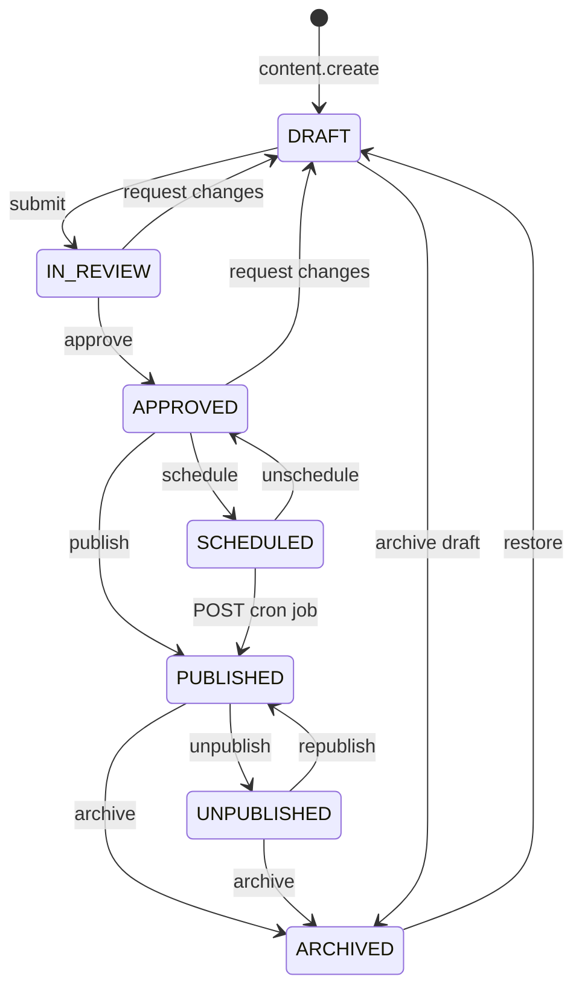
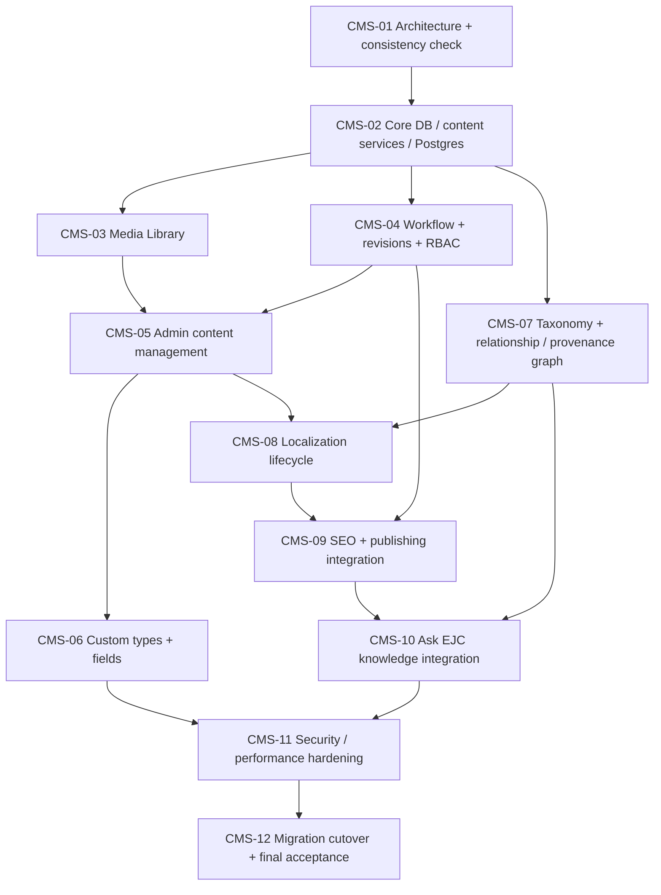

# CMS-01 Implementation plan

Stacked delivery after PR #1 (`cursor/ejc-identity-platform-90e1`). Each CMS-NN is its own branch/PR. No merge or deploy from this package. No secrets.

<!-- cms-canonical
roles: SUPER_ADMIN, ADMIN, EDITOR, AUTHOR, REVIEWER, MEDIA_MANAGER
capabilities: content.create, content.edit, content.review, content.publish, content.delete, content.verify, media.upload, media.delete, users.manage, roles.manage, settings.manage, audit.read
workflow: DRAFT, IN_REVIEW, APPROVED, SCHEDULED, PUBLISHED, UNPUBLISHED, ARCHIVED
truth: VERIFIED, UNVERIFIED, TO_CONFIRM, PRIVATE
-->

Truth statuses (`VERIFIED`, `UNVERIFIED`, `TO_CONFIRM`, `PRIVATE`) are **not** workflow states. No transition below changes truth. No public query and no Ask EJC path reads `PRIVATE`.

---

## 9. Workflow state machine

Existing `PublishState` (`DRAFT`, `REVIEW`, `PUBLISHED`, `ARCHIVED`) is the subset we migrate from. Target states are the seven below.

Live `PUBLISHED` rows are not edited in place. `content.edit` on a live item creates a `PendingRevision` at `DRAFT`; that copy uses the same machine until `APPROVED → PUBLISHED` swaps it onto the live row.

### Allowed transitions and who may perform them

| From | To | Capability | Roles | Extra gates |
|---|---|---|---|---|
| *(new)* | `DRAFT` | `content.create` | SUPER_ADMIN, ADMIN, EDITOR, AUTHOR | AUTHOR becomes `authorId` |
| `DRAFT` | `IN_REVIEW` | `content.edit` | SUPER_ADMIN, ADMIN, EDITOR, AUTHOR (own) | — |
| `IN_REVIEW` | `DRAFT` | `content.review` | SUPER_ADMIN, ADMIN, REVIEWER | note required |
| `IN_REVIEW` | `APPROVED` | `content.review` | SUPER_ADMIN, ADMIN, REVIEWER | does **not** set `TruthStatus` |
| `APPROVED` | `DRAFT` | `content.review` | SUPER_ADMIN, ADMIN, REVIEWER | request changes |
| `APPROVED` | `SCHEDULED` | `content.publish` | SUPER_ADMIN, ADMIN | `scheduledAt` in the future |
| `APPROVED` | `PUBLISHED` | `content.publish` | SUPER_ADMIN, ADMIN | safety + identity lock; labels if not `VERIFIED` |
| `SCHEDULED` | `PUBLISHED` | `content.publish` | SUPER_ADMIN, ADMIN to cancel; cron as system | `POST /api/cron/publish` + secret header |
| `SCHEDULED` | `APPROVED` | `content.publish` | SUPER_ADMIN, ADMIN | clears `scheduledAt` |
| `PUBLISHED` | `UNPUBLISHED` | `content.publish` | SUPER_ADMIN, ADMIN | explicit; public loaders drop the row |
| `UNPUBLISHED` | `PUBLISHED` | `content.publish` | SUPER_ADMIN, ADMIN | safety check **again** |
| `PUBLISHED` | `ARCHIVED` | `content.publish` | SUPER_ADMIN, ADMIN | soft; `archivedAt` |
| `UNPUBLISHED` | `ARCHIVED` | `content.publish` | SUPER_ADMIN, ADMIN | soft; `archivedAt` |
| `DRAFT` | `ARCHIVED` | `content.delete` | SUPER_ADMIN, ADMIN; EDITOR own drafts | soft |
| `ARCHIVED` | `DRAFT` | `content.publish` | SUPER_ADMIN, ADMIN | restore; audit kept |

<!-- cms-transitions
DRAFT:IN_REVIEW:content.edit
IN_REVIEW:DRAFT:content.review
IN_REVIEW:APPROVED:content.review
APPROVED:DRAFT:content.review
APPROVED:SCHEDULED:content.publish
APPROVED:PUBLISHED:content.publish
SCHEDULED:PUBLISHED:content.publish
SCHEDULED:APPROVED:content.publish
PUBLISHED:UNPUBLISHED:content.publish
UNPUBLISHED:PUBLISHED:content.publish
PUBLISHED:ARCHIVED:content.publish
UNPUBLISHED:ARCHIVED:content.publish
DRAFT:ARCHIVED:content.delete
ARCHIVED:DRAFT:content.publish
-->

Truth is **not** a workflow edge. `content.verify` (SUPER_ADMIN; biography always SUPER_ADMIN) sets `VERIFIED` with provenance + `verifiedById` / `verifiedAt` / `verificationNote`. Publishing never calls it.

Illegal examples: AUTHOR `IN_REVIEW` → `PUBLISHED`; REVIEWER → `PUBLISHED`; any role `DRAFT` → `PUBLISHED`; any role setting `truthStatus = VERIFIED` via the publish action.

Timestamps: `submittedAt`, `reviewedAt`, `publishedAt`, `unpublishedAt`, `archivedAt` plus `WorkflowEvent` (from/to/actor/note).

**Scheduler (D9).** `POST /api/cron/publish` with `x-cms-cron-secret` (value issued on the VM, not committed). Never GET. If safety fails, write `CmsObservabilityEvent` `publish_failure` and keep `SCHEDULED`.

**Public visibility (D1).** Only `PUBLISHED` + `PUBLIC` + not `PRIVATE` + not deleted. `IN_REVIEW` is admin-only. Today’s NOW/Challenge `REVIEW` placeholders become `PUBLISHED` + `TO_CONFIRM` (+ `EXAMPLE` where they already are) so e2e banners stay. Ask may include `approvedForAsk` rows that are `UNVERIFIED` / `TO_CONFIRM` **labelled**, never as fact.

---

## 15. Testing strategy

### Keep running (every PR)

| Gate | Command | Today |
|---|---|---|
| Lint | `npm run lint` | ESLint `eslint.config.mjs` |
| Typecheck | `npm run typecheck` | `tsc --noEmit` |
| Unit | `npm test` | Vitest `tests/unit/**/*.test.ts` |
| Build | `npm run build` | `prisma generate && next build` |
| E2E | `npm run test:e2e` | Playwright desktop + mobile (`playwright.config.ts`) |
| Docs consistency | included in `npm test` | `tests/unit/cms-docs-consistency.test.ts` (this PR) |

CI: `.github/workflows/ci.yml` quality job. CMS-02 adds a Postgres service; until then SQLite remains for PR #1 and this docs PR.

### Add by phase (do not change existing tests in CMS-01 except this check)

| Phase | New tests |
|---|---|
| CMS-01 | Docs exist, 18 sections, CMS-01–12 acceptance headings, exact RBAC/workflow/truth tokens, transition×matrix cross-check, mermaid structural parse (offline; no mermaid JS renderer) |
| CMS-02 | Schema generate; public loaders still exclude `PRIVATE` / `deletedAt`; identity lock vs `CONFIRMED`; no raw SQL |
| CMS-03 | Magic-byte reject; SVG sanitize; path traversal; zip-slip; capability on upload |
| CMS-04 | Role × capability table; illegal workflow transitions; publish does not flip truth; rollback appends revision |
| CMS-05 | Action unauthenticated; IDOR author; unsaved-guard not required in unit — e2e editor happy path FR+EN desktop/mobile |
| CMS-06 | Zod-from-`FieldDefinition`; reject unknown keys; no EAV table |
| CMS-07 | TypedRelation unique; Proof Graph query omits private edges |
| CMS-08 | Source edit marks other locale `OUTDATED`; FR default `sourceLocale` |
| CMS-09 | Sitemap still lists current paths; no duplicate canonical; Person JSON-LD still from lock |
| CMS-10 | Private row cannot be retrieved even if `approvedForAsk` is wrongly true **or** service ignores that combo; unverified labelled; existing Ask e2e |
| CMS-11 | Threat tests listed in `docs/CMS-SECURITY.md`; measure TTFB notes in PR |
| CMS-12 | Dual-read flag; e2e unchanged; migrate up/down on empty Postgres |

Regression: every bug found after merge gets a unit or e2e case in the fixing PR (mandate §22).

Visual: reuse Playwright `shot()` (`tests/e2e/artifacts.ts`) on desktop and mobile for touched public routes. FR and EN: keep `tests/e2e/global-setup.ts` locale list.

---

## 17. Implementation dependency graph

Mandate §24 order: CMS-01 … CMS-12. Edges are **hard** dependencies. Dashed notes are optional parallelism after the parent lands.

CMS-03 and CMS-04 may proceed in parallel after CMS-02. CMS-07 may start after CMS-02 in parallel with CMS-04. CMS-06 needs editors (CMS-05). CMS-12 is last and is the only phase that flips `CMS_READ_SOURCE` default.

---

## 18. Acceptance criteria

Each phase must keep lint, typecheck, unit, build, and existing e2e green unless the phase explicitly replaces a CI database URL (CMS-02) while still passing those commands.

### CMS-01

Architecture package only (this PR).

Acceptance criteria:

- [ ] `docs/CMS-ARCHITECTURE.md`, `docs/CMS-DATA-MODEL.md`, `docs/CMS-SECURITY.md`, `docs/CMS-MIGRATION.md`, `docs/CMS-IMPLEMENTATION-PLAN.md` exist
- [ ] Together they cover mandate §25 items 1–18 (headings `## 1.` … `## 18.`)
- [ ] Prisma sketches include PKs, FKs, uniques, indexes, composite indexes, `onDelete`, timestamps, soft delete where justified; JSONB only for custom values and block payloads; no EAV
- [ ] Mermaid ER, Proof Graph relations, workflow, dependency graph are fenced
- [ ] RBAC roles and capabilities and workflow states match across the five files
- [ ] Truth vs workflow documented; PRIVATE excluded from public/Ask
- [ ] Database strategy chosen (Postgres for CMS dev/CI/prod)
- [ ] Docs consistency unit test passes
- [ ] No application behaviour change; no PR #1 modification; draft PR stacked on `cursor/ejc-identity-platform-90e1`
- [ ] Existing lint, typecheck, unit, build, e2e pass

### CMS-02

Core DB and content services.

Acceptance criteria:

- [ ] Single Prisma schema, `provider = postgresql`
- [ ] `prisma/migrations` created; Fedora **Podman** (`podman-compose`) Postgres by default (`docker compose` alternative); CI service container
- [ ] Additive columns + new tables from `docs/CMS-DATA-MODEL.md` applied
- [ ] Bootstrap admin `SUPER_ADMIN`; seed still only confirmed facts + labelled examples
- [ ] `lib/cms/content` public loaders return only `PUBLISHED` + `PUBLIC` + not `PRIVATE` + not deleted; `truthStatus` is a label only
- [ ] Identity-lock unit test: published identity/Kinshasa match `CONFIRMED`
- [ ] Dual-write of `publishState` ↔ `workflowState` and `SourceLink` still works
- [ ] No GraphQL / extra backend
- [ ] Quality job green on Postgres

### CMS-03

Media library.

Acceptance criteria:

- [ ] `LOCAL` adapter in gitignored disk dir; S3-compatible interface implemented
- [ ] Magic-byte sniff + declared MIME mismatch rejected
- [ ] SVG sanitized with `sanitize-html` (or SVG-specific allowlist on top of it); public render is `` not inline SVG
- [ ] ZIP path traversal rejected; allowlist enforced
- [ ] Derivatives created for raster images via `sharp`
- [ ] Upload route handlers require matching `Origin` / `Sec-Fetch-Site` (CSRF)
- [ ] Private assets only via signed URL; `storageKey` not in public HTML
- [ ] `media.upload` / `media.delete` enforced
- [ ] CSP not wildcarded; same-origin or explicit host
- [ ] No production bucket secrets in the repo

### CMS-04

Workflow, revisions, RBAC.

Acceptance criteria:

- [ ] All seven workflow states exist; table of transitions enforced in `lib/cms/workflow`
- [ ] `requireCapability` lands here (CMS-04); JWT does not carry capabilities
- [ ] `content.verify` is SUPER_ADMIN-only by default; biography always SUPER_ADMIN
- [ ] `attemptPublish` requires `content.publish` and still does not mutate truth
- [ ] Live edits create a `PendingRevision`; publish swaps the live snapshot
- [ ] `APPROVED → DRAFT` and `IN_REVIEW → DRAFT` exist
- [ ] Scheduler is `POST /api/cron/publish` with secret header (never GET)
- [ ] Schedule + unpublish + archive + restore write `WorkflowEvent` + audit
- [ ] Rollback creates a new `ContentRevision`; history intact
- [ ] Table-driven RBAC and illegal-transition tests
- [ ] AUTHOR IDOR denied
- [ ] Last SUPER_ADMIN cannot be removed; ADMIN cannot grant or downgrade SUPER_ADMIN

### CMS-05

Admin content management.

Acceptance criteria:

- [ ] Editors for native types used on the public site (Identity, Journey, Places, NOW, Record, Proof, Thinking, Ask sources, Ledger, Signals, Ventures)
- [ ] Search, filters, pagination; hide internal ids
- [ ] Preview uses publishing safety (does not publish)
- [ ] Autosave + unsaved-change guard
- [ ] Validation errors and state visible
- [ ] Usable at Playwright desktop and mobile viewports
- [ ] Existing publish / tagline / moderate / learning actions still audited
- [ ] No invented biography in fixtures

### CMS-06

Custom types and fields.

Acceptance criteria:

- [ ] Admin can define a non-native `ContentType` + `FieldDefinition`s without a code change
- [ ] Values stored in JSONB `customValues` only; definitions relational
- [ ] Server-side Zod from definitions; unknown keys rejected
- [ ] No EAV table
- [ ] Allowlisted blocks persist in `ContentBlock.payload` JSONB
- [ ] `FieldKind.JSON` documented as last-resort

### CMS-07

Taxonomy + relationship/provenance graph.

Acceptance criteria:

- [ ] Vocabularies: category, tag, topic, industry, location, organization, role
- [ ] `TypedRelation` unique `(fromNodeId, toNodeId, relationType)`; Proof Graph consumes published, non-private edges
- [ ] `ProvenanceSource` has type, URL, title, date, verification, verified by/at, notes, optional media; no confidence **percent**
- [ ] `SourceLink` dual-write still populated
- [ ] Kinshasa is `BORN_IN` (confirmed), not `LIVED_IN`. Origin `EVIDENCES` birth record remains the only verified place fact. No inferred places.

### CMS-08

Localization lifecycle.

Acceptance criteria:

- [ ] Translation entities for natives; `sourceLocale` default `FR`
- [ ] Source edit marks the other locale `OUTDATED`
- [ ] Admin Translations view: missing / outdated / complete
- [ ] Public EN/FR URLs still resolve with today’s strings (imported as `COMPLETE`)
- [ ] EN `MISSING` → `/en/{slug}` 404; sitemap/hreflang omit EN; Ask falls back to FR with a locale label
- [ ] UI chrome may remain `lib/i18n.ts`

### CMS-09

SEO + publishing integration.

Acceptance criteria:

- [ ] Per-content SEO title, description, canonical, OG, robots
- [ ] Person JSON-LD still matches `CONFIRMED`
- [ ] Sitemap still includes every current path in `app/sitemap.ts`; additive slugs only
- [ ] Public loaders use `workflowState = PUBLISHED` + `visibility = PUBLIC` + not `PRIVATE` (no `IN_REVIEW` public exception)
- [ ] `revalidatePath` on publish/unpublish for affected locale routes
- [ ] No duplicate canonicals

### CMS-10

Ask EJC knowledge integration.

Acceptance criteria:

- [ ] `/api/ask` loads corpus only via `lib/cms/ask-corpus.ts`
- [ ] Filter: `PUBLISHED` + `PUBLIC` + not `PRIVATE` + `approvedForAsk` + not EXAMPLE + not deleted (`truthStatus` labels only)
- [ ] Unverified / to-confirm answers are included when approved and labelled; never stated as fact
- [ ] Private content not returned even if an admin is logged in
- [ ] Existing Ask e2e (Kinshasa answer, net-worth refusal) passes
- [ ] Still no generative hallucination path unless owner later authorizes a model

### CMS-11

Security and performance hardening.

Acceptance criteria:

- [ ] Every §17 threat has an automated test as listed in `docs/CMS-SECURITY.md`
- [ ] CSP nonce model unchanged; no `x-nonce` leak
- [ ] Upload + stored XSS + IDOR + RBAC re-tested
- [ ] TTFB of `/en`, `/en/record`, `/en/proof`, `/api/ask` recorded; no Redis added unless a measured bottleneck names it
- [ ] Indexes used by list/Ask queries verified (`EXPLAIN` in PR notes)
- [ ] Observability events for publish/validation/media/search failures

### CMS-12

Migration cutover and final acceptance.

Acceptance criteria:

- [ ] `CMS_READ_SOURCE` default `cms`; `legacy` still works
- [ ] All URLs, FR/EN, Proof slugs, Journey ids, NOW examples, Record birth, Ask sources preserved
- [ ] Seed + hard-coded Journey imported; no new biographical facts
- [ ] Dual-write can be disabled behind a flag after soak
- [ ] Column drops **not** done without owner authorization
- [ ] Full gate: lint, typecheck, unit, integration/RBAC/security/migration tests, e2e desktop+mobile FR+EN, build
- [ ] Fedora local validation documented against Podman/`podman-compose` Postgres (`docker compose` alternative)
- [ ] No production deploy from the PR; no secrets committed

---

## Next executable phase

**CMS-02 — Core DB / content services:** switch Prisma to PostgreSQL (Fedora Podman/`podman-compose` + CI service), add migrations for additive columns and new tables (`ContentNode`, `PendingRevision`, verify columns), implement `lib/cms` public loaders + identity lock test, keep dual-write of legacy `publishState` / `SourceLink`, do not build the full editor yet. `requireCapability` waits for CMS-04.

---

## Resolved technical decisions (not owner gates)

| Topic | Decision | Why |
|---|---|---|
| Audit diff format | **JSON Patch RFC 6902** in `AuditLog.payload` TEXT; **full snapshot** always on `ContentRevision` / `PendingRevision` | Standard, small, unit-testable diffs. Rollback must not reconstruct from a patch chain. |
| Scheduler | **`POST /api/cron/publish`** + `x-cms-cron-secret` | State-changing GET is forbidden. Header secret stays on the VM. |
| Rich-text sanitiser | **`sanitize-html`** | Maintained allowlist sanitiser that runs in Node without jsdom. |
| Image variants | **`sharp`** | libvips, de facto Next.js pipeline, JPEG/PNG/WebP/AVIF. |
| Fedora DB | **Podman / `podman-compose`** default; `docker compose` alternative | Fedora’s default container stack. |
| SUPER_ADMIN integrity | ADMIN cannot grant, disable, or downgrade SUPER_ADMIN; last SUPER_ADMIN cannot be removed | Privilege-escalation control. |
| `requireCapability` | **CMS-04** | Schema `role` may be added in CMS-02; enforcement with workflow. |

---

## Open decisions requiring the owner

Only genuine authorization, content, or merge/deploy questions. Each has a recommended default so CMS-02 can start.

1. **Production object storage** (provider, bucket, credentials) at CMS-03. **Default:** S3-compatible API behind the existing adapter; credentials issued on the VM, never committed.
2. **Phase F column drops and purges** after CMS-12 soak. **Default:** do not drop leftover dual-write columns or purge soft-deleted media until the owner authorizes.
3. **Generative model for Ask EJC.** **Default:** none. Keep `retrieveFromApprovedSources` until the owner authorizes a model.
4. **Whether the identity lock ever moves from `lib/identity.ts` to the DB.** **Default:** lock stays in code; CMS rows must match `CONFIRMED`.
5. **Owner-supplied facts and media** for new content types (principles, extra places, portrait, etc.). **Default:** empty labelled placeholders only; never invent.
6. **Merge / deploy / retarget PR #2 to `main`.** **Default:** no merge and no deploy from this package; retarget after PR #1 merges, on owner approval.
7. **Whether ADMIN may hold `content.verify`.** **Default: no.** Biography and identity verification remain SUPER_ADMIN-only even if this is later flipped for other types.
