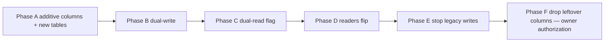

# CMS-01 Migration and media/storage

Non-destructive, reversible design for moving today’s hard-coded and seeded content into CMS tables **without** dropping URLs, SEO, FR/EN, Proof Graph, Journey, NOW, Record, or Ask EJC. Production has **no data yet** (`docs/DEPLOYMENT.md`). This PR does not migrate, deploy, or write secrets.

<!-- cms-canonical
roles: SUPER_ADMIN, ADMIN, EDITOR, AUTHOR, REVIEWER, MEDIA_MANAGER
capabilities: content.create, content.edit, content.review, content.publish, content.delete, media.upload, media.delete, users.manage, roles.manage, settings.manage, audit.read
workflow: DRAFT, IN_REVIEW, APPROVED, SCHEDULED, PUBLISHED, UNPUBLISHED, ARCHIVED
truth: VERIFIED, UNVERIFIED, TO_CONFIRM, PRIVATE
-->

Workflow (`DRAFT`, `IN_REVIEW`, `APPROVED`, `SCHEDULED`, `PUBLISHED`, `UNPUBLISHED`, `ARCHIVED`) and truth (`VERIFIED`, `UNVERIFIED`, `TO_CONFIRM`, `PRIVATE`) stay independent during and after migration. Publishing a migrated row does not verify it.

---

## 10. Media/storage

Today there is **no file library**. `MediaItem` (`prisma/schema.prisma`) is a press-appearance record (title, outlet, URL, summary). Admin `/admin/media` lists those rows and offers `PublishButton`. `docs/BACKLOG.md` already lists “Object storage for approved photographs”. Portrait is a monogram placeholder (`components/identity/portrait-placeholder.tsx`).

### Adapter

```
MediaStorageAdapter
  put(key, bytes, contentType) → void
  get(key) → bytes
  delete(key) → void
  sign(key, ttlSeconds) → url   // private
  publicUrl(key) → url          // public only
```

| Environment | Adapter | Root / bucket |
|---|---|---|
| Local Fedora / CI | `LOCAL` | `var/cms-media/` (gitignored); keys `{yyyy}/{cuid}.{ext}` |
| Production | `S3` or `GCS` via **S3-compatible** API | Owner supplies bucket + credentials at CMS-03 (secrets — not in git) |

DB holds **metadata only** (`MediaAsset`, `MediaDerivative`, `MediaAssetTranslation` in `docs/CMS-DATA-MODEL.md`). Never persist private filesystem paths in public HTML.

### Signed / controlled access

- `visibility = PRIVATE` (default for new uploads): serve only through a short-lived signed URL issued to an authenticated admin (or a later owner-approved private share). Token is HMAC of `assetId + exp` with `AUTH_SECRET`, or provider-native signed GET.
- `visibility = PUBLIC` **and** `workflowState = PUBLISHED`: same-origin URL (Nginx → app or object store) so CSP `img-src 'self' data:` remains valid. If the store is on another host, CMS-03/11 **explicitly** adds that host to CSP — never a wildcard.
- Soft-deleted assets: adapter object retained until an authorized purge; public URLs 404.

### Derivatives

On successful image upload (CMS-03): thumbnail, `sm`, `md`, `lg`, plus WebP/AVIF when decode works. Store each as `MediaDerivative`. Public pages use derivatives, not originals. Video/audio: store native metadata (duration, dimensions) and allowlisted embed hosts; no transcoding in v1.

### File-signature sniffing

Read magic bytes **before** write:

| Allow | Sniff |
|---|---|
| JPEG | `FF D8 FF` |
| PNG | `89 50 4E 47` |
| WebP | `RIFF….WEBP` |
| AVIF | `ftyp` + `avif` |
| SVG | sanitized XML; not trusted by declared MIME alone |
| PDF | `%PDF-` |
| DOCX/XLSX/PPTX | ZIP + `[Content_Types].xml` + expected part |
| ZIP | `PK` + path-safe entries |

Reject mismatch between `mimeDeclared` and `mimeSniffed`. Persist both. Serve sniffed type + existing `X-Content-Type-Options: nosniff`.

### SVG sanitization

Strip `script`, `foreignObject`, event handlers, `javascript:` hrefs, external entities, and remote `xlink`. Prefer public display as `` (raster derivative). Inline SVG in HTML is disallowed.

### Allowlists (mandate §3)

Images: JPEG, PNG, WebP, AVIF, sanitized SVG. Video: file metadata + YouTube/Vimeo embeds. Audio: file metadata + Spotify/SoundCloud embeds. Documents: PDF, DOCX, XLSX, PPTX, ZIP. Everything else rejected.

### Capabilities

`media.upload` / `media.delete` as in `docs/CMS-SECURITY.md`. AUTHORS may upload to their drafts; they cannot delete others’ assets.

---

## 14. Migration strategy

### Goals

- Existing content must not disappear (mandate §21).
- Preserve public URLs (`/en`, `/fr`, and every path in `app/sitemap.ts`).
- Preserve SEO (`metadataBase`, Person JSON-LD, canonical origin `lib/site-url.ts` `publicSiteUrl()`).
- Preserve FR/EN strings already in seed, dictionaries, and Journey.
- Preserve Proof Graph slugs (`identity-name`, `origin-kinshasa`, `nationality-congolese`, `role-founder-ceo`) — `lib/i18n.ts` `proofNodes` and e2e headings depend on them.
- Preserve Journey chapter ids (`origin`, `places`, `builder`, `responsibility`, `record`) — `tests/unit/journey.test.ts` and e2e `[data-chapter]`.
- Preserve NOW kinds and labelled EXAMPLE placeholders (`tests/e2e/public.spec.ts`).
- Preserve Record `birth-kinshasa-1994`.
- Preserve Ask sources `identity-facts`, `origin-facts`, `no-catalogue` and refusal behaviour (`tests/unit/ask-ejc.test.ts`, e2e Ask).
- Non-destructive and **reversible**.
- Dev SQLite (PR #1) versus production PostgreSQL (empty).

### What exists to migrate

| Source | Path | Destination |
|---|---|---|
| Confirmed facts lock | `lib/identity.ts` `CONFIRMED` | Stays in code; CMS Identity/Place/Venture/Proof must **match**, not replace, until CMS-12 optional lock-from-DB (owner) |
| UI chrome | `lib/i18n.ts` | Stays; optional `NavItem` later |
| Journey chapters | `components/journey/journey-chapters.tsx` `journeyChapters()` | `JourneyChapter` + translations (copy current FR/EN bodies) |
| Seed identity EN/FR | `prisma/seed.ts` | Additive workflow/truth columns; later one group + `IdentityTranslation` |
| Place Kinshasa + slot | seed | Same rows + `TruthStatus` `VERIFIED` / `TO_CONFIRM` |
| Venture CLEVONE SARL | seed | Same; `exposureOnly` stays true |
| Record birth | seed | Same slug |
| Four proofs | seed | Same slugs; `relatedRecordId` on origin |
| Now 8×2 EXAMPLE | seed | Keep `IN_REVIEW` + `TO_CONFIRM` + `EXAMPLE`; public NOW still shows labelled placeholders |
| Example thinking/thesis/ledger/media | seed | Keep labelled EXAMPLE; not Ask-approved |
| Ask sources ×3 | seed | `approvedForAsk = true`, `PUBLISHED`, `VERIFIED` |
| SourceLink mandate | seed `MANDATE_SOURCE` / `MANDATE_SOURCE_KEY` | Dual-write `ProvenanceSource` `OWNER_CONFIRMED` |
| Admin user | seed argon2 upsert | `role = SUPER_ADMIN` |
| Learning example | seed | Unchanged |
| Principles personal | empty page | No invented rows |
| Portrait | placeholder | No stock image |

**Do not invent** education, extra places, career dates, awards, press, principles, or mottos to “fill” CMS tables.

### Phased, reversible cutover



| Phase | When | Revert |
|---|---|---|
| A | CMS-02 | `prisma migrate` down / restore dump; old columns still populated |
| B | CMS-02–08 | Writers keep `titleEn`/`titleFr` / `publishState` / `SourceLink` |
| C | CMS-08–10 | `CMS_READ_SOURCE=legacy\|cms` env (default `legacy`) |
| D | CMS-12 after Fedora + CI green | Flip default to `cms`; revert = set `legacy` |
| E | CMS-12 + soak | Revert = re-enable dual-write |
| F | **Owner authorization only** | Requires backup restore; not in CMS-01–11 |

No `prisma migrate reset` on production (`docs/DEPLOYMENT.md` Forbidden). No `DROP DATABASE`.

### Field mapping (workflow / truth)

| Legacy | New |
|---|---|
| `PublishState.DRAFT` | `WorkflowState.DRAFT` |
| `PublishState.REVIEW` | `WorkflowState.IN_REVIEW` |
| `PublishState.PUBLISHED` | `WorkflowState.PUBLISHED` |
| `PublishState.ARCHIVED` | `WorkflowState.ARCHIVED` |
| `VerificationStatus` FACTUAL | `TruthStatus.VERIFIED` |
| `DECLARED` / `IN_PROGRESS` | `UNVERIFIED` |
| `NEEDS_CONFIRMATION` | `TO_CONFIRM` |
| *(new)* | `PRIVATE` |
| `ExampleFlag` | unchanged |
| `AskSource.approved` | copy to `approvedForAsk` |

Proof Graph `verification` column is **copied, not replaced**.

### SQLite → PostgreSQL

- CMS-02 introduces `prisma/migrations` against PostgreSQL.
- Local/CI stop using `file:./dev.db` for CMS work (see data-model strategy).
- Type notes: existing `String` dates (`occurredOn`, `birthDate`) stay strings during dual-write (seed uses `1994-09-01`). Booleans and enums migrate via Prisma. `AnalyticsEvent.meta` and audit `payload` stay TEXT.
- Empty production: `migrate deploy` + `tsx prisma/seed.ts` once, then rotate admin password and remove `ALLOW_ADMIN_CREATE_IN_PRODUCTION`.
- If a developer still has a SQLite `dev.db` from PR #1: dump via a one-shot script (CMS-02) that reads SQLite and inserts into Postgres, or re-seed (seed is the full editorial dataset today). Re-seed is acceptable **only** because production is empty and seed is deterministic confirmed-facts + labelled examples.

### URL and SEO preservation

| URL | Source after migration |
|---|---|
| `/en`, `/fr` | Home still uses `CONFIRMED` + published counts |
| `/[locale]/identity` | `getIdentity` → CMS profile + lock |
| `/[locale]/now` | NOW loader keeps `PUBLISHED` + labelled `IN_REVIEW` EXAMPLE |
| `/[locale]/record` | `getPublishedRecord` + slug `birth-kinshasa-1994` |
| `/[locale]/proof` | same proof slugs |
| `/[locale]/journey` | `JourneyChapter` in chapter-id order |
| `/[locale]/places` | `kinshasa` + unconfirmed slot |
| `/[locale]/ask` | same API + three sources |
| `/[locale]/thinking/[slug]` | existing slug |
| `/[locale]/challenge/[slug]` | existing slug |
| sitemap / robots / feeds | same paths; CMS-09 may add published thinking slugs **additively** |

`personJsonLd()` remains from `CONFIRMED` until CMS-09 optionally merges sourced extras (same lock).

### Ask EJC

Cutover does not widen the corpus. Example thinking/thesis/now rows stay `approvedForAsk = false`. Private rows never enter the query. Retrieval function stays `retrieveFromApprovedSources` until an owner-approved model exists.

### Tests as migration gates

Do not rewrite existing assertions to hide gaps. CMS-12 is done when:

- `npm run lint`, `typecheck`, `test`, `build`, `test:e2e` pass on Postgres
- `tests/e2e/public.spec.ts` still sees Kinshasa, TCK sentence, no removed command-line slogan, no wealth claim, Ask refusal, labelled Now examples, journey badges
- `tests/unit/journey.test.ts` chapter statuses unchanged
- `tests/unit/identity.test.ts` / publishing-safety / ask-ejc still pass
- New consistency + identity-lock tests pass

### Rollback

1. Set `CMS_READ_SOURCE=legacy` (phase C–D).
2. App code on previous SHA (`docs/DEPLOYMENT.md` Rollback) — PM2 stop, checkout, build, restart.
3. Database down-migration only for **additive** CMS-02 tables if needed; never drop `IdentityProfile` / `Place` / `AskSource`.
4. Production dump path remains `/home/clevones/backups/eroish.clevones.com/…` — human restore-test on a temp DB.

---

## Migration risks

1. **Loader behaviour drift** — NOW and Challenge currently include `REVIEW`. A naive `PUBLISHED`-only CMS filter would break e2e. Mitigation: explicit placeholder rule in `docs/CMS-ARCHITECTURE.md`.
2. **Locale model split** — Identity/Now/Signal are row-per-locale; others are column pairs. Dual-write until CMS-08.
3. **`SourceLink` star → provenance** — lose `isApprovedAsk` if not copied. Dual-write.
4. **SQLite vs Postgres in contributor workflows** — Fedora without Docker fails CMS-02+. Document Compose as required for CMS branches.
5. **Incomplete `schema.postgres.prisma`** — cannot deploy from it today. Unify in CMS-02.
6. **No migration history** — first migrate must be generated from the evolved schema, not from a fake SQLite history.
7. **Identity lock bypass** — editor changes birthplace in CMS. Mitigation: CI diff against `CONFIRMED`.
8. **Ask corpus widening** — auto-approving all published rows. Mitigation: `approvedForAsk` default false except the three seed sources.
9. **CSP vs media host** — breaking images or CSP. Mitigation: same-origin first.
10. **Soft-delete vs unique slugs** — unique `slug` blocks restore-as-new. Use partial unique index `(slug) WHERE deletedAt IS NULL` on Postgres (CMS-02).

---

## Related documents

Schema sketches: `docs/CMS-DATA-MODEL.md`. Threats for upload/SVG/MIME/path: `docs/CMS-SECURITY.md`. Phase acceptance: `docs/CMS-IMPLEMENTATION-PLAN.md`.
