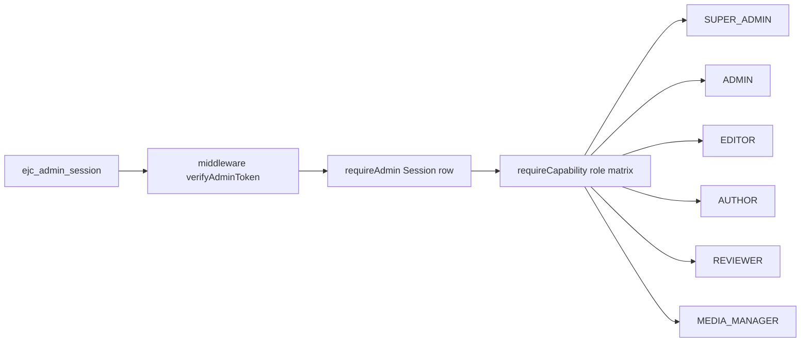

# CMS-01 Security — RBAC, threat model, audit

Keeps every PR #1 control (`middleware.ts`, `lib/csp.ts`, `lib/auth-cookie.ts`, `lib/auth-verify.ts`, `lib/admin/session.ts`, `lib/safe-relative-path.ts`, `lib/publishing-safety.ts`, `next.config.ts`). The CMS adds capability checks, upload defenses, and a stricter Ask boundary. It does not weaken CSP, move secrets into git, or embed `AUTH_SECRET` in docs.

<!-- cms-canonical
roles: SUPER_ADMIN, ADMIN, EDITOR, AUTHOR, REVIEWER, MEDIA_MANAGER
capabilities: content.create, content.edit, content.review, content.publish, content.delete, media.upload, media.delete, users.manage, roles.manage, settings.manage, audit.read
workflow: DRAFT, IN_REVIEW, APPROVED, SCHEDULED, PUBLISHED, UNPUBLISHED, ARCHIVED
truth: VERIFIED, UNVERIFIED, TO_CONFIRM, PRIVATE
-->

**Axes.** Workflow (`DRAFT`, `IN_REVIEW`, `APPROVED`, `SCHEDULED`, `PUBLISHED`, `UNPUBLISHED`, `ARCHIVED`) is not truth. Truth (`VERIFIED`, `UNVERIFIED`, `TO_CONFIRM`, `PRIVATE`) is not publication. `PRIVATE` is never selectable by public queries or Ask EJC.

---

## 8. RBAC matrix

Compatible with the existing cookie session: middleware still verifies the HMAC JWT; `requireAdmin()` still requires a live `Session` row; **new** `requireCapability(capability)` (CMS-04) loads `AdminUser.role` and applies this matrix. Capabilities are **not** stored in the JWT (avoids stale grants after role change). Logout still deletes the session (`app/api/auth/logout/route.ts`).



### Roles × capabilities

| Capability | SUPER_ADMIN | ADMIN | EDITOR | AUTHOR | REVIEWER | MEDIA_MANAGER |
|---|---|---|---|---|---|---|
| `content.create` | yes | yes | yes | yes | no | no |
| `content.edit` | yes | yes | yes | own drafts only | no | no |
| `content.review` | yes | yes | no | no | yes | no |
| `content.publish` | yes | yes | no | no | no | no |
| `content.delete` | yes | yes | soft-delete own drafts | no | no | no |
| `media.upload` | yes | yes | yes | yes | no | yes |
| `media.delete` | yes | yes | no | no | no | yes |
| `users.manage` | yes | yes | no | no | no | no |
| `roles.manage` | yes | no | no | no | no | no |
| `settings.manage` | yes | yes | no | no | no | no |
| `audit.read` | yes | yes | no | no | yes | no |

Notes:

- **SUPER_ADMIN** is the only role that assigns/changes roles (`roles.manage`). The seeded bootstrap user becomes `SUPER_ADMIN`.
- **ADMIN** operates the control plane (publish, users except role grant, settings) but cannot promote themselves to change the role graph.
- **EDITOR** may edit others’ `DRAFT` / `IN_REVIEW` copy; cannot publish or review-approve.
- **AUTHOR** creates and edits **own** `DRAFT` rows; submit to `IN_REVIEW` only.
- **REVIEWER** transitions `IN_REVIEW` → `APPROVED` or back to `DRAFT`; cannot publish.
- **MEDIA_MANAGER** uploads/deletes assets; cannot publish identity facts.
- High-risk biography fields (name, birth, nationality, org) require `content.publish` **and** the identity lock test (`lib/identity.ts` `CONFIRMED`).
- Learning Engine proposals still need a human (`decideLearningProposal` today); capability `settings.manage` or `content.publish` (ADMIN+) to approve. The engine never publishes.

### Session compatibility

| Existing function | CMS change |
|---|---|
| `verifyAdminToken` | Unchanged |
| `findActiveSession` / `requireAdmin` | Unchanged as the floor; every admin page still calls it |
| `attemptPublish` | Add `requireCapability("content.publish")` |
| `updateIdentityTagline` | `content.edit` |
| `moderateChallenge` | `content.review` |
| `decideLearningProposal` | `content.publish` or `settings.manage` |
| Console layout | `requireAdmin` stays; nav items hide without capability (CMS-05) |

Unauthenticated `/admin/*` still rewrites to `/admin/login?next=` via `adminLoginPath` + `safeAdminNext`.

---

## 12. Security threat model

Every threat in CMS mandate §17. Mitigation **and** a test. Existing tests stay; new tests land in the phase that introduces the surface.

### XSS (reflected)

| | |
|---|---|
| Threat | Query/body reflected into HTML without encoding. |
| Mitigation | React default encoding; no `dangerouslySetInnerHTML` except Person JSON-LD (`app/layout.tsx`) built from `personJsonLd()` (not request input). CSP `script-src 'nonce-…' 'strict-dynamic'` (`lib/csp.ts` `buildCsp`). |
| Test | Existing `tests/unit/csp.test.ts`; CMS-11 fixture that a `?q=<script>` on Ask/search is text. |

### Stored XSS

| | |
|---|---|
| Threat | Rich text / captions / Ask body store `<script>` or `javascript:` and execute for visitors or admins. |
| Mitigation | Sanitize on write (allowlist tags; strip event handlers, `javascript:`, SVG script). Do not mark sanitized HTML as `VERIFIED`. CSP still blocks inline scripts without nonce. Admin preview uses the same sanitizer. |
| Test | CMS-05/11: save `` and assert stored + rendered output has no handler; e2e that the string does not execute. |

### CSRF

| | |
|---|---|
| Threat | Cross-site POST triggers publish/login/upload. |
| Mitigation | Same-origin admin; cookie `SameSite=lax` (`adminSessionCookieOptions`); server actions are origin-bound; login is JSON POST same-origin. Do not add CORS for admin mutations. `form-action 'self'` in CSP. |
| Test | Existing login e2e; CMS-04: action without session cookie returns redirect/401; document that cross-site form cannot include the cookie on lax POST from other sites (classic navigation CSRF on GET-logout already uses POST). |

### SSRF

| | |
|---|---|
| Threat | Editor pastes an internal URL (`http://127.0.0.1`, metadata service, `file://`) as media fetch or provenance fetch. |
| Mitigation | CMS **does not** server-side fetch arbitrary editor URLs in CMS-03. Embeds are allowlisted (YouTube, Vimeo, Spotify, SoundCloud) by host. If a fetch-preview is added later: block private IPs, link-local, `file`, `gopher`; require https; timeout. Provenance `url` is stored, not fetched by default. |
| Test | CMS-03: upload-by-URL rejected or absent; embed host allowlist unit test. |

### SQLi

| | |
|---|---|
| Threat | String-concatenated SQL. |
| Mitigation | Prisma parameterized client only (`lib/db.ts`). No `$executeRaw` except the existing SQLite `PRAGMA` (removed on Postgres). Search uses Prisma `contains` / `tsvector` params. |
| Test | CMS-02: grep gate that `lib/cms` has no unparameterized raw SQL; existing unit suite still passes. |

### Malicious uploads

| | |
|---|---|
| Threat | Polyglot, executable, zip-slip, oversized bomb. |
| Mitigation | Allowlist MIME + extension + **magic-byte sniff** (`mimeSniffed` must match allowlist and be compatible with `mimeDeclared`). Max size per kind. Documents: PDF/DOCX/XLSX/PPTX/ZIP only. ZIP: inspect for path `..` and absolute paths before store. Store outside the web root; serve via adapter. |
| Test | CMS-03: reject HTML-as-jpg, reject oversize, reject zip with `../`; accept a small PNG whose sniff is `image/png`. |

### SVG

| | |
|---|---|
| Threat | Stored SVG XSS (`<script>`, `onload`, external entity). |
| Mitigation | Sanitize SVG on upload (strip script, foreignObject, event attrs, javascript hrefs, external entities). Optional: rasterize to PNG derivative for public display and keep SVG admin-only. CSP `img-src` does not execute script in `` in modern browsers; still sanitize because inline SVG in HTML would. |
| Test | CMS-03: SVG with `<script>alert(1)</script>` stored sanitized / rejected; public render is `` not inline SVG. |

### MIME spoofing

| | |
|---|---|
| Threat | `Content-Type: image/png` with HTML or SVG body. |
| Mitigation | Sniff first bytes; persist both declared and sniffed; reject mismatch. Serve with sniffed type + `X-Content-Type-Options: nosniff` (already in `next.config.ts`). |
| Test | CMS-03: file named `x.png` starting with `<html` rejected. |

### Path traversal

| | |
|---|---|
| Threat | `storageKey` or download `path` is `../../.env`. |
| Mitigation | Adapter generates keys (`{yyyy}/{cuid}.{ext}`); never use original filename as the key. `safeRelativePath` already rejects `..` / schemes for redirects. Local disk: resolve under a configured root and reject escape. |
| Test | Existing `tests/unit/safe-relative-path.test.ts`; CMS-03: adapter unit tests for `../` original filename. |

### Broken access control

| | |
|---|---|
| Threat | Missing `requireAdmin` on a new editor route; public loader returns drafts. |
| Mitigation | Console layout already calls `requireAdmin`. Every new server action starts with `requireAdmin` + `requireCapability`. Public services hard-code the public filter (no `includePrivate` argument). |
| Test | Existing `tests/unit/admin-auth-guard.test.ts` + e2e `tests/e2e/admin-auth.spec.ts`; CMS-04/05: each action listed in a table tested unauthenticated. |

### IDOR

| | |
|---|---|
| Threat | Author edits another author’s id; public fetch by cuid returns `PRIVATE` / `DRAFT`. |
| Mitigation | Load-then-authorize: `content.edit` for AUTHOR checks `authorId === user.id` unless elevated. Public `findFirst` always includes workflow/truth/visibility/deletedAt predicates. Signed media URLs expire and bind to the asset id. |
| Test | CMS-04: AUTHOR cannot `update` another user’s draft; CMS-10: Ask corpus query with a known private id returns nothing. |

### Session fixation

| | |
|---|---|
| Threat | Attacker sets a session cookie pre-login. |
| Mitigation | Login always creates a **new** `Session.id` and JWT `jti` (`app/api/auth/login/route.ts`). Logout deletes the row. Cookie overwritten. No session id accepted from the client as the primary key input. |
| Test | Existing auth unit tests (`tests/unit/auth-verify.test.ts`, `tests/unit/auth-cookie.test.ts`); CMS-04: login rotates `jti`. |

### Open redirect

| | |
|---|---|
| Threat | `next=` / `to=` sends users to `//evil`. |
| Mitigation | `safeRelativePath`, `safeAdminNext` (admin console only, max 512), `reencodeAdminLoginRedirect`, `/api/redirect` relative `Location`. `OPEN_REDIRECT_PROBES` in `lib/safe-relative-path.ts`. |
| Test | Existing `tests/unit/safe-relative-path.test.ts`, `tests/unit/admin-login-path.test.ts`, `tests/unit/request-redirect.test.ts`. |

### Privilege escalation

| | |
|---|---|
| Threat | EDITOR publishes; AUTHOR grants SUPER_ADMIN; JWT claims forged role. |
| Mitigation | Role only on `AdminUser` row. `roles.manage` is SUPER_ADMIN-only. Publish requires `content.publish`. Do not trust a `role` field on the client or JWT. Identity lock prevents publishing contradictory biography even for SUPER_ADMIN without failing CI (process control). |
| Test | CMS-04: matrix table-driven tests (each role × each capability × allow/deny). Attempt publish as AUTHOR fails. |

### Additional CMS-specific threats (in scope because they inherit §17)

| Threat | Mitigation | Test |
|---|---|---|
| Ask EJC private leak | `ask-corpus` filter; route ignores admin cookie for widening | CMS-10 unit + e2e |
| Publishing verifies facts | `publishingSafetyCheck` never writes `truthStatus` / `verification` | Existing `tests/unit/publishing-safety.test.ts`; CMS-04 extends |
| Soft-delete bypass | Public queries require `deletedAt == null` | CMS-02 query tests |
| Secret in git / logs | `.env.example` names only; audit payload redacts password hashes | Existing deployment rule; CMS-04 redact unit |

**Never weaken:** CSP nonce model, `x-nonce` non-emission, COOP, nosniff, DENY frames, HSTS, `APP_ORIGIN` trust, argon2, 8h HttpOnly cookie.

---

## 13. Audit/versioning design

### Today

- `writeAudit` / `writeRevision` in `lib/audit.ts`.
- `AuditLog`: actor (optional FK), action, entity, entityId, summary, payload TEXT, createdAt. Index `(entity, entityId)`.
- `ContentRevision`: entity, entityId, version, snapshot TEXT, note, optional typed FKs, createdAt. Index `(entity, entityId)`.
- Used by login, publish (success + `PUBLISH_BLOCKED`), tagline, learning, challenge, connect, seed.
- Admin Security page lists last 50 audits and 20 revisions (`app/admin/(console)/security/page.tsx`).
- Seed writes one revision for Kinshasa and one `SEED` audit.

### Target

| Event | Audit | Revision |
|---|---|---|
| Create / update / translate | yes (before/after or RFC6902-style diff in `payload` TEXT) | yes, full snapshot, monotonic `version` |
| Workflow transition | yes + `WorkflowEvent` row | snapshot of states |
| Publish / unpublish / archive / restore | yes | yes |
| Publish blocked | yes (`PUBLISH_BLOCKED`, reasons) — already exists | no |
| Media upload/delete | yes (checksum, sniffed MIME, not raw bytes) | no (asset row is the record) |
| Role / user change | yes | no |
| Rollback | yes (`ROLLBACK`) | **new** revision with previous snapshot; old rows stay |
| Login / logout | login already; add logout | no |

Rules:

- Rollback **never deletes** `AuditLog`, `WorkflowEvent`, or prior `ContentRevision` rows.
- `payload` / `snapshot` remain **TEXT** (not JSONB) per JSONB policy.
- Additive columns: `requestPath`, `requestId` on audit; `actorId` + unique `(entity, entityId, version)` on revision.
- Soft-deleted content remains revisable/restorable; purge (if ever) is an owner authorization and still keeps audit.
- `PRIVATE` payloads are visible only to roles with `audit.read` (ADMIN+ / REVIEWER / SUPER_ADMIN). Authors do not read other authors’ private diffs.

### Request context

From `x-request-path` (middleware already sets it, then strips from the response) and a generated request id. Do not store raw IP on audit (Connect already stores `ipHash` only).

---

## Ask EJC security boundary

`app/api/ask/route.ts` today: rate-limit, Zod, `approved: true` + `PUBLISHED`, `retrieveFromApprovedSources`. CMS-10 replaces the Prisma `findMany` with `lib/cms/ask-corpus.ts`:

```
approvedForAsk = true
AND workflowState = PUBLISHED
AND truthStatus != PRIVATE
AND visibility = PUBLIC
AND exampleFlag != EXAMPLE
AND deletedAt IS NULL
```

The route **must not** take a `session` parameter that widens the set. Unverified/to-confirm public rows, if `approvedForAsk`, are returned with an explicit label — never as established fact. No source → existing refusal copy (`lib/i18n.ts` `ask.refusal`).

---

## Privacy / reputational safety (platform mandate §§15–16)

Publishing safety already blocks unsourced / unverified / example facts. CMS-04 extends the candidate with `containsSensitiveContent` over concatenated fields and a confirmation step for high-risk types (identity, places, ledger). Never publish home address, live location, ID, bank, private phones, family, contracts, secrets, infra, balances, or third-party private data. Never invent awards, press, wealth, or slogans.

---

## Related documents

Workflow transitions: `docs/CMS-IMPLEMENTATION-PLAN.md` §9. Media sniffing: `docs/CMS-MIGRATION.md` §10. Model FKs/`onDelete`: `docs/CMS-DATA-MODEL.md`.
